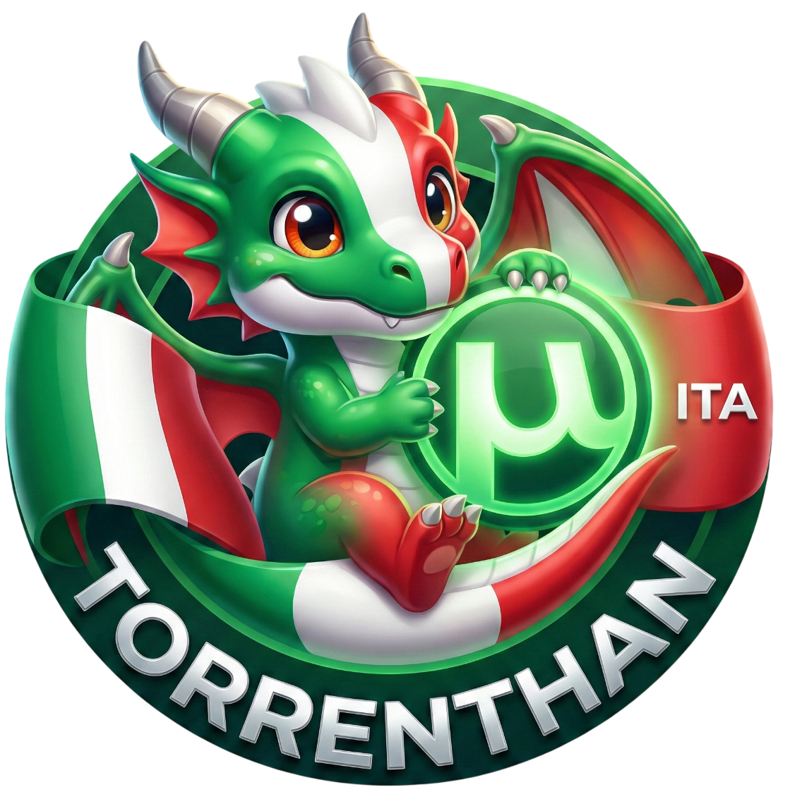

<div align="center">

  

  # Torrenthan 🇮🇹
  
  <h3><b>L'evoluzione italiana di Torrentio</b></h3>
  <p>Ottimizzato per Real-Debrid, TorBox e P2P ad alte prestazioni.</p>

  <br>

  <a href="https://torrenthan.stremioluca.dpdns.org/">
    
  </a>

  <br>
  <br>

  [](https://www.python.org/)
  [](https://fastapi.tiangolo.com/)
  [](https://www.docker.com/)
  [](LICENSE)

  <br>

  <p align="center">
    <b>Torrenthan</b> non è un semplice fork. È una riscrittura logica che inietta tracker personalizzati, forza il caricamento istantaneo (Lazy Loading) e prioritizza i contenuti italiani, eliminando i tempi di attesa tipici degli scraper tradizionali.
  </p>

  <p align="center">
    <a href="#-architettura">Architettura</a> •
    <a href="#-installazione">Installazione</a> •
    <a href="#-configurazione">Configurazione</a> •
    <a href="#-legal--disclaimer">⚖️ Note Legali</a>
  </p>
</div>

---
<div align="center">

  ## ⚡ Introduzione e Filosofia

Torrenthan è un addon per Stremio che si basa direttamente sui risultati di Torrentio, offrendo agli utenti italiani un accesso mirato e ottimizzato ai contenuti. Pur sfruttando la solidità e l’affidabilità della piattaforma originale, Torrenthan è progettato per selezionare e presentare esclusivamente materiale in lingua italiana, garantendo così un’esperienza totalmente focalizzata sul pubblico nazionale.

Grazie a questa specializzazione, gli utenti possono navigare, scoprire e riprodurre film e serie in italiano senza dispersioni o contenuti non pertinenti, con la sicurezza di utilizzare un addon che mantiene gli standard qualitativi di Torrentio, adattati alle esigenze del mercato italiano. Torrenthan rappresenta quindi la soluzione ideale per chi cerca un’alternativa italiana all’addon originale, combinando efficienza, precisione e completezza dei risultati.

---

## 🧠 Architettura Tecnica

Torrenthan introduce due concetti chiave per migliorare la stabilità e la velocità dello streaming in Italia.

### 1. Risoluzione Just-in-Time (Lazy Loading)
Invece di sovraccaricare le API di Real-Debrid/TorBox con centinaia di richieste hash all'apertura del catalogo:
1.  L'addon genera URL "virtuali" che puntano al proprio endpoint `/playback`.
2.  Stremio riceve la lista in millisecondi.
3.  Al click, il server backend esegue la transazione API (Add Magnet -> Select Files -> Unrestrict Link).
4.  L'utente viene reindirizzato con un `HTTP 302` al flusso video finale MP4/MKV.

### 2. Tracker Injection System (TIS)
Molti torrent, specialmente quelli più vecchi o di nicchia italiani, falliscono su Real-Debrid perché il magnet link originale non contiene abbastanza tracker aggiornati.
Torrenthan **inietta dinamicamente** una lista curata di 10+ Tracker UDP ad alte prestazioni in ogni singola richiesta magnet.
> *Risultato:* Anche se il torrent originale ha 0 peer nel file `.torrent`, l'aggiunta dei tracker permette al cloud di trovare fonti alternative nella DHT network.

### 3. Smart Parsing
Il parser analizza i titoli grezzi dei file video per estrarre metadati cruciali che spesso sfuggono agli scraper tradizionali:
* Identificazione codec (HEVC/H.265 vs AVC).
* Riconoscimento Dynamic Range (HDR, Dolby Vision, HDR10+).
* Mapping audio avanzato (TrueHD, DTS-HD MA, Dolby Digital Plus).

---

## 🚀 Features Principali

* **Zero Latency Listing:** Caricamento immediato dei risultati di ricerca.
* **Dual-Provider Support:** Integrazione nativa sia per **Real-Debrid** (API REST) che per **TorBox**.
* **Italian Priority:** Algoritmo di filtro che privilegia tracce audio e sottotitoli in lingua italiana.
* **Fallback Management:** Gestione automatica degli errori di risoluzione API.
* **Secure Stream:** Nessun IP residenziale esposto durante lo streaming (tutto passa tramite Debrid).

---

## 🛠 Installazione e Deploy

### Opzione A: Docker (Raccomandata)

Il metodo più pulito e sicuro per eseguire Torrenthan è tramite container.

1.  **Clona la repository:**
    ```bash
    git clone https://github.com/LUC4N3X/Torrenthan
    cd torrenthan
    ```

2.  **Build dell'immagine:**
    ```bash
    docker build -t torrenthan-server .
    ```

3.  **Avvio del container:**
    ```bash
    docker run -d -p 7000:7000 --restart unless-stopped --name torrenthan torrenthan-server
    ```

### Opzione B: Esecuzione Locale (Python)

Richiede Python 3.10 o superiore.

```bash
# Installazione dipendenze
pip install -r requirements.txt

# Avvio server Uvicorn
python main.py
```
⚙️ **Configurazione & Accesso**

Dopo aver avviato il server, Torrenthan offre una **configurazione immediata via browser**, senza modifiche manuali ai file.  

👉 **Apri il tuo browser e vai su:**  http://TUO-IP:7000/
 

Da qui potrai:

- 🎯 **Selezionare il provider** (Real-Debrid, TorBox o P2P nativo)  
- 🔑 **Inserire la tua API Key privata**  
- 📺 **Impostare filtri di qualità** (720p, 1080p, 4K...)  
- 🚀 **Abilitare lo streaming P2P** direttamente dall’addon  
- 📎 **Generare il link di installazione per Stremio** cliccando “Install”  

💡 **Extra:** l’interfaccia è pensata per essere veloce e intuitiva, così da avere subito il tuo setup pronto per lo streaming.


---

<div align="center">

[](https://en.wikipedia.org/wiki/Disclaimer)
[](https://opensource.org/)

# ⚖️ LEGAL & DISCLAIMER
### ⚠️ IMPORTANTE: LEGGERE ATTENTAMENTE PRIMA DELL'USO

</div>

### 1. 🧬 Natura del Software
**Torrenthan** è un motore di meta-ricerca e indicizzazione automatizzato. È fondamentale comprendere che questo software:

> * ❌ **NON** ospita, archivia o distribuisce alcun file video, audio o contenuto protetto da copyright.
> * ❌ **NON** possiede un database proprio di contenuti.
> * ✅ **AGISCE** esclusivamente come interfaccia tecnica ("Middleware") tra l'utente, plugin di terze parti (come Torrentio) e servizi di API pubbliche (come Real-Debrid o TorBox).

---

### 2. 👤 Responsabilità dell'Utente
L'utilizzo di questo software è a **totale discrezione e rischio dell'utente finale**.

* È **responsabilità esclusiva dell'utente** assicurarsi di possedere i diritti necessari per visualizzare o scaricare i contenuti accessibili tramite i servizi configurati.
* Gli sviluppatori di Torrenthan **non hanno alcun controllo** sui risultati forniti dagli scraper di terze parti né sui file accessibili tramite i servizi Debrid.

---

### 3. 🛡️ Conformità DMCA / Copyright
Poiché Torrenthan **non ospita contenuti** ma si limita a processare stringhe di testo (hash e magnet link) generate da terze parti:
* Non è tecnicamente possibile rimuovere contenuti dal "software" in quanto il software **non ne contiene**.
* Per richieste di rimozione contenuti (DMCA Takedown), rivolgersi direttamente ai **siti di hosting sorgente** o ai **tracker pubblici** indicizzati.

---

### 4. 🎓 Scopo Educativo
Questo progetto è stato sviluppato a **puro scopo didattico** e di ricerca per:
1.  Analizzare le performance delle librerie `FastAPI` in Python.
2.  Studiare l'interazione asincrona con API REST complesse e protocolli P2P.

> 🚫 **L'autore condanna fermamente la pirateria informatica e incoraggia l'uso di servizi di streaming legali e autorizzati.**

---

<div align="center">
  <sub>Developed with logic & passion.</sub><br>
  <sub><i>LUC4N3X © 2025</i></sub>
  <br><br>
  <a href="https://ko-fi.com/luc4n3x" target="_blank">
    
  </a>
</div>

---

<div align="center">

  <h3>🧩 LEGACY & FOUNDATION</h3>
  
  <p>
    Torrenthan non nasce dal nulla. È un'evoluzione costruita sulle solide fondamenta di <b>Torrentio ITA</b>.
    <br>
    Un doveroso tributo allo sviluppatore che ha tracciato la strada per la community italiana.
  </p>

  <br>

  <a href="https://github.com/diogomiguel93">
    
  </a>
  <br>
  <a href="https://github.com/diogomiguel93">
    
  </a>

</div>
